# Lista Encadeada com Cabeçalho

Este projeto implementa uma **lista encadeada com nó-cabeçalho** em linguagem C, com diversas operações úteis para manipulação dinâmica de dados.

## 🧠 Funcionalidades

A lista conta com as seguintes operações:

### ✅ Já implementadas originalmente:
- `criarLista` – Cria uma nova lista com nó-cabeçalho
- `inserirInicio` – Insere um valor no início da lista
- `imprimirLista` – Imprime os elementos da lista
- `remover` – Remove a primeira ocorrência de um valor
- `liberarLista` – Libera toda a memória da lista

### ✳️ Implementadas por mim:
- `inserirFim` – Insere um valor no final da lista
- `contarElementos` – Retorna o número de elementos da lista
- `obterMaior` – Retorna o maior valor presente na lista
- `obterMenor` – Retorna o menor valor presente na lista
- `estaVazia` – Verifica se a lista está vazia
- `reverterLista` – Inverte a ordem dos elementos
- `buscar` – Retorna se um valor está presente na lista
- `copiarLista` – Retorna uma cópia profunda da lista
- `concatenarListas` – Concatena duas listas
- `removerDuplicatas` – Remove valores duplicados da lista

## 🛠️ Compilação e Execução

Compile com:

```bash
gcc main.c listacomcabecalho.c -o programa
```

Execute com:

```bash
./programa
```

## 🧪 Demonstração

A funcionalidade de cada função é demonstrada no arquivo `main.c`, por meio de:

- Um **menu interativo** com as seguintes opções:

```bash
  1. Inserir no início;
  2. Inserir no final;
  3. Remover valor;
  4. Imprimir lista;
  5. Contar elementos;
  6. Buscar valor;
  7. Obter maior valor;
  8. Obter menor valor;
  9. Descobrir se a lista está vazia;
  10. Inverter ordem;
  11. Copiar lista;
  12. Concatenar listas;
  13. Remover duplicatas;
  0. Sair;
```

- Diversos `printf`s mostrando as alterações nas listas após cada operação

Abaixo estão alguns exemplos de execução do programa:

### ➕ Inserir no início
<p align="center">
  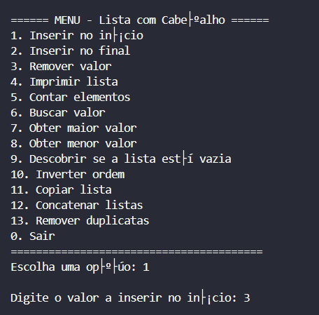
  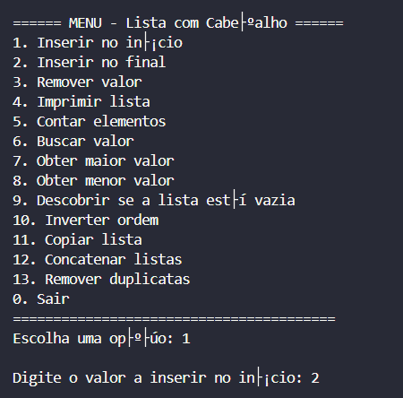
  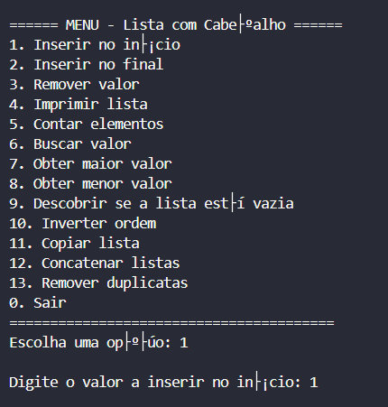
  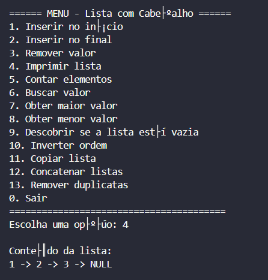
</p>

***

### ➕ Inserir no final
<p align="center">
  
  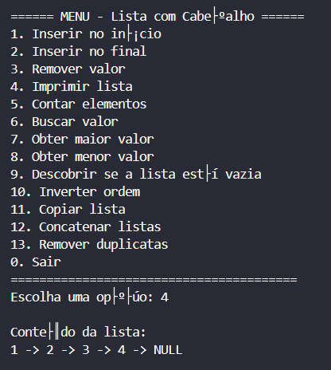
</p>

***

### ❌ Remover valor
<p align="center">
  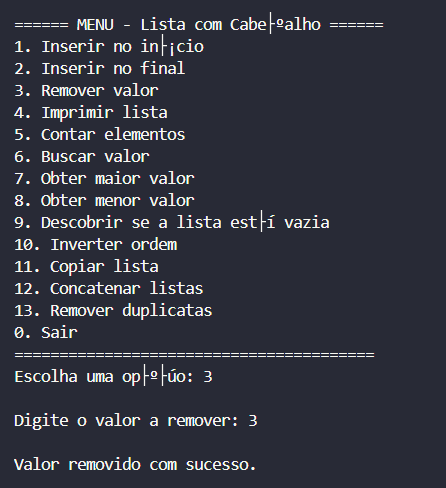
  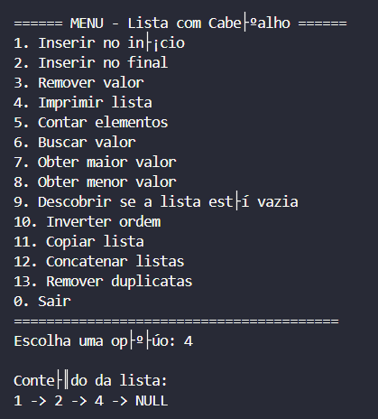
</p>

***

### 📄 Imprimir lista
<p align="center">
  
</p>

***

### 🔢 Contar elementos
<p align="center">
  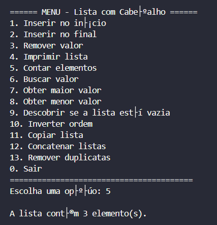
</p>

***

### 🔍 Buscar valor
<p align="center">
  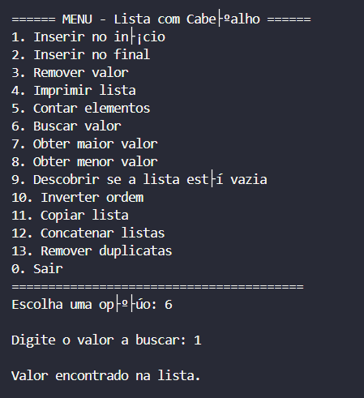
  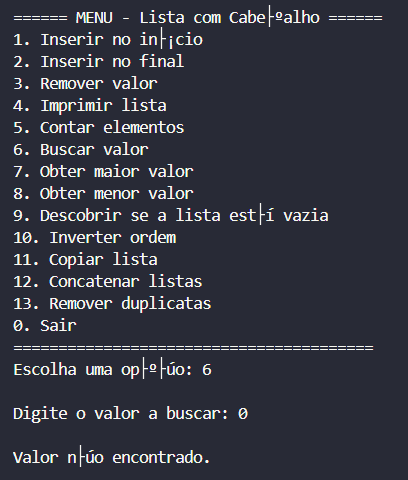
</p>

***

### 🔺 Obter maior valor
<p align="center">
  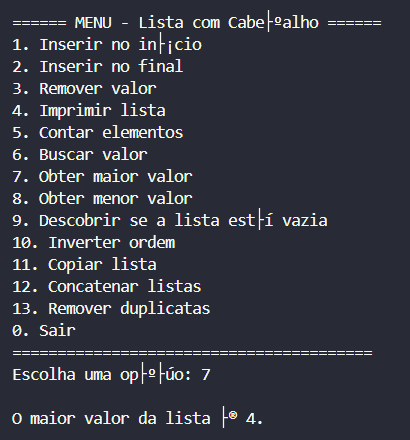
</p>

***

### 🔻 Obter menor valor
<p align="center">
  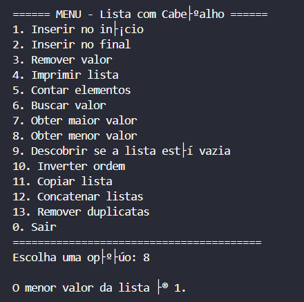
</p>

***

### 📭 Descobrir se a lista está vazia
<p align="center">
  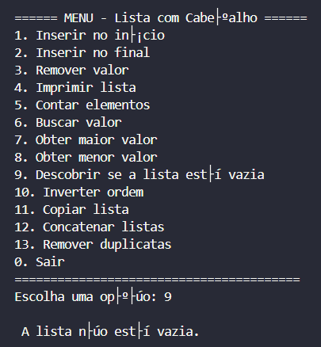
</p>

***

### 🔁 Inverter ordem
<p align="center">
  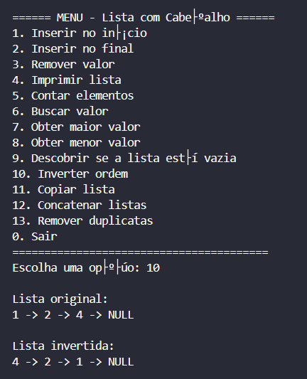
</p>

***

### 📝 Copiar lista
<p align="center">
  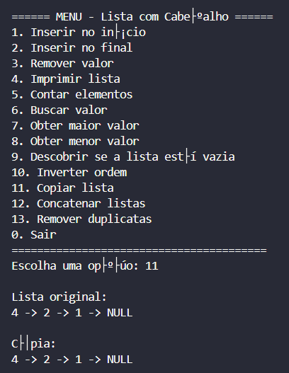
</p>

***

### 📎 Concatenar listas
<p align="center">
  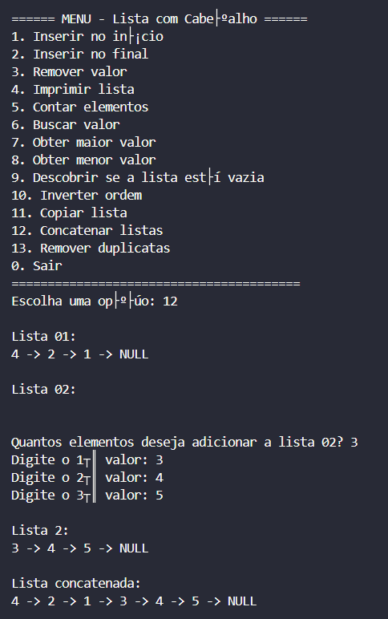
</p>

***

### 🧹 Remover duplicatas
<p align="center">
  
</p>

***

### 🚪 Sair
<p align="center">
  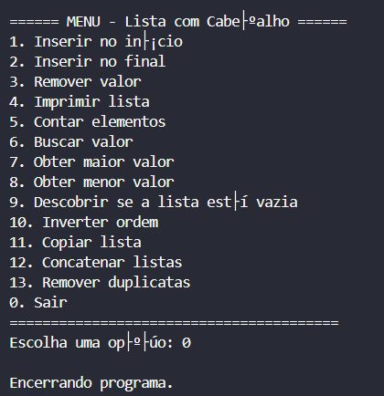
</p>

## 📌 Observações

Este projeto foi desenvolvido como parte da disciplina de Estrutura de Dados I.  
O objetivo foi praticar o uso de listas encadeadas com cabeçalho em linguagem C.

## 🙋‍♀️ Autora

Projeto desenvolvido por Carolina Milano — Estudante de Análise e Desenvolvimento de Sistemas da UFPR.
